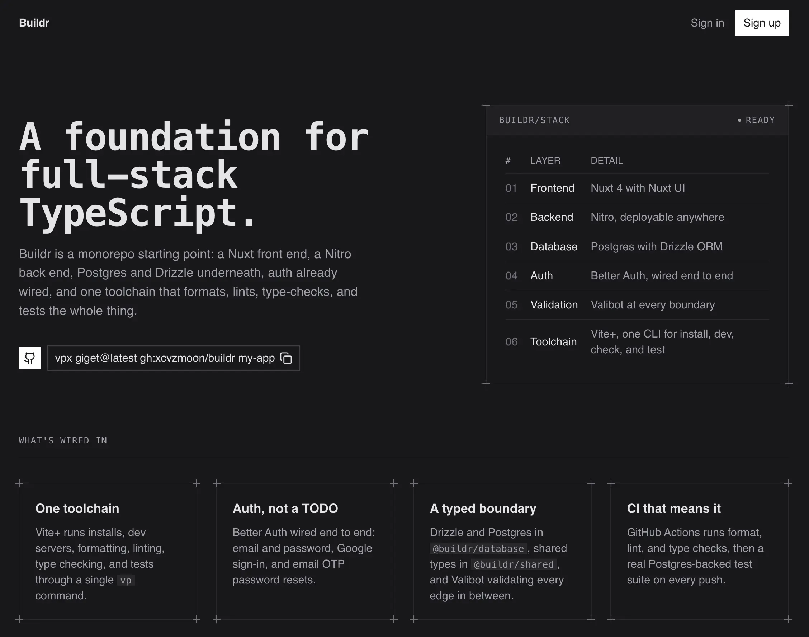

# Buildr

An opinionated monorepo foundation for building modern full-stack TypeScript applications: a Nuxt front end, a Nitro back end, Postgres and Drizzle underneath, auth already wired, and one toolchain that formats, lints, type-checks, and tests all of it.

[](https://github.com/xcvzmoon/buildr/actions/workflows/ci.yml)
[](./LICENSE)



## Get started

Scaffold this repository as your own project with [Vite+](https://viteplus.dev) (`vp`) and [giget](https://github.com/unjs/giget):

```bash
vpx giget@latest gh:xcvzmoon/buildr my-app
cd my-app
```

Install and run it:

```bash
vp install
vp run dev
```

`vp run dev` starts every app in the workspace. To run just one, filter by its workspace name:

```bash
vp run --filter web dev   # Nuxt app on http://localhost:5173
vp run --filter api dev   # Nitro server on http://localhost:3000
```

Each app that needs configuration ships a `.env.example` — copy it to `.env` and fill in the values before running that workspace. See [Environment variables](#environment-variables) for what each one expects.

## What's inside

| Layer      | Detail                                           |
| ---------- | ------------------------------------------------ |
| Frontend   | Nuxt 4 with Nuxt UI                              |
| Backend    | Nitro, deployable anywhere                       |
| Database   | Postgres with Drizzle ORM                        |
| Auth       | Better Auth, wired end to end                    |
| Validation | Valibot at every boundary                        |
| Toolchain  | Vite+, one CLI for install, dev, check, and test |

- **One toolchain.** Vite+ runs installs, dev servers, formatting, linting, type checking, and tests through a single `vp` command — see [Development](#development).
- **Auth, not a TODO.** Better Auth is wired end to end: email and password, Google sign-in, and email OTP password resets, with working sign-in, sign-up, forgot-password, and reset-password pages already built.
- **A typed boundary.** Drizzle and Postgres live in `@buildr/database`, shared types in `@buildr/shared`, and Valibot validates every edge in between.
- **CI that means it.** GitHub Actions runs format, lint, and type checks, then a real Postgres-backed test suite on every push — see [`.github/workflows/ci.yml`](.github/workflows/ci.yml).

## Project structure

```
apps/
  api/          Nitro server — auth, API routes, structured logging (evlog)
  web/          Nuxt 4 app — pages, auth UI, and the landing page
packages/
  database/     Drizzle schema, migrations, and Postgres client (@buildr/database)
  shared/       Types shared across apps (@buildr/shared)
tools/
  oxlint/       Custom lint rules, including an "anti-slop" rule set
  scripts/      One-off scripts (e.g. the release script)
tests/          Cross-workspace test suite (@buildr/tests)
```

`server/` inside `apps/api` follows Nitro's convention: `api/` for `/api`-prefixed handlers, `routes/` for unprefixed ones, plus `middleware/`, `plugins/`, `utils/`, and `tasks/` as needed. `apps/web` is a standard Nuxt 4 app (`app/pages`, `app/components`, `app/layouts`, `app/middleware`).

## Environment variables

### `apps/web/.env`

| Variable               | Purpose                                 |
| ---------------------- | --------------------------------------- |
| `PORT`                 | Dev server port (defaults to `5173`)    |
| `API_ORIGIN`           | Where `/api/**` requests are proxied to |
| `NUXT_PUBLIC_SITE_URL` | Public site URL used for redirects      |

### `apps/api/.env`

| Variable                                                              | Purpose                                                          |
| --------------------------------------------------------------------- | ---------------------------------------------------------------- |
| `PORT`                                                                | Server port (defaults to `3000`)                                 |
| `DB_URL`                                                              | Postgres connection string                                       |
| `BETTER_AUTH_SECRET`                                                  | Session signing secret — generate with `openssl rand -base64 32` |
| `BETTER_AUTH_URL`                                                     | The API's own base URL                                           |
| `WEB_ORIGIN`                                                          | The web app's origin, for CORS and redirects                     |
| `GOOGLE_CLIENT_ID` / `GOOGLE_CLIENT_SECRET`                           | Google OAuth credentials                                         |
| `DYMO_API_KEY`                                                        | Dymo email/identity verification key                             |
| `EMAIL_FROM`                                                          | From-address for transactional email                             |
| `RESEND_API_KEY`                                                      | Resend API key, if sending mail through Resend                   |
| `SMTP_HOST` / `SMTP_PORT` / `SMTP_USER` / `SMTP_PASS` / `SMTP_SECURE` | SMTP fallback, if not using Resend                               |

### `packages/database/.env`

| Variable | Purpose                                                        |
| -------- | -------------------------------------------------------------- |
| `DB_URL` | Postgres connection string (the database workspace's own copy) |

## Development

```bash
vp install          # install dependencies
vp run dev          # run every app's dev server
vp check            # format + lint + type check the whole workspace
vp check --fix      # same, but auto-fixes what it can
vp test             # run tests once
vp test watch       # run tests in watch mode
```

A Git hook runs `vp check --fix` on staged files at commit time (configured in `vite.config.ts`), so most formatting and lint issues never leave your machine.

Any workspace's own scripts can be run the same way, by filtering to its name: `vp run --filter <name> <script>`.

### Database

`packages/database` wraps [Drizzle Kit](https://orm.drizzle.team/kit-docs/overview):

```bash
vp run --filter database generate   # generate a migration from schema changes
vp run --filter database migrate    # apply pending migrations
vp run --filter database push       # push schema directly, for local iteration
vp run --filter database pull       # introspect an existing database into schema
vp run --filter database studio     # open Drizzle Studio
vp run --filter database check      # verify migrations are consistent with the schema
```

## Docker

Multi-stage `Dockerfile`s for `apps/api` and `apps/web`, plus a `docker-compose.yml` that wires them to Postgres and a one-off `migrate` job that applies Drizzle migrations before the API starts.

```bash
vp run docker:build     # build the api, web, and migrate images
vp run docker:up        # start postgres, migrate, api, and web
vp run docker:logs      # follow logs for all services
vp run docker:migrate   # re-run migrations on demand
vp run docker:down      # stop and remove the containers
```

Before the first run, copy the root `.env.example` to `.env` (Postgres credentials and the ports exposed to the host), and copy `apps/api/.env.example` and `apps/web/.env.example` to `.env` in each app, same as local dev — `docker-compose.yml` reads those files directly.

`web`'s image bakes `API_ORIGIN` in at build time (default `http://api:3000`, the compose service name) because `nuxt.config.ts` resolves it while building the SSR proxy rule, not at request time. Both images run as a non-root user and expose a container `HEALTHCHECK`: `apps/api` against `GET /health`, `apps/web` against `GET /`.

## Conventions

The full set of coding conventions — TypeScript strictness, Valibot at the boundary, no speculative abstractions, Conventional Commits, and more — lives in [`AGENTS.md`](./AGENTS.md) (also read as `CLAUDE.md` by AI coding agents). [`.github/CONTRIBUTING.md`](.github/CONTRIBUTING.md) covers the day-to-day workflow: setup, testing, commit messages, and the pull request process.

## License

[MIT](./LICENSE) © Mon Albert Gamil
